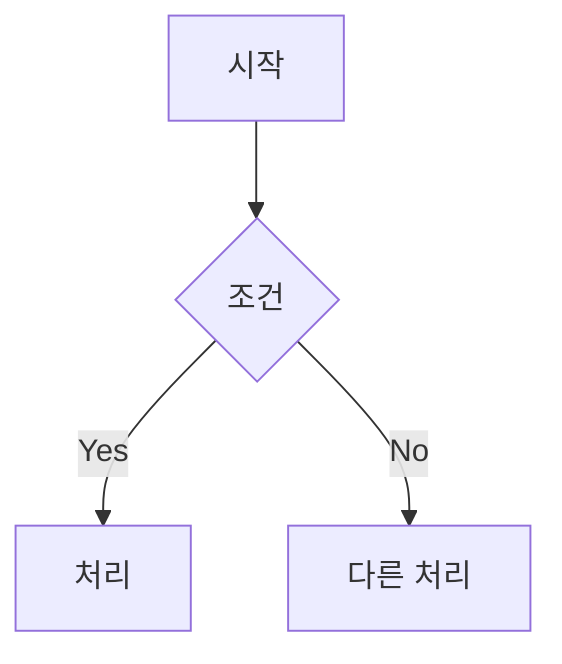
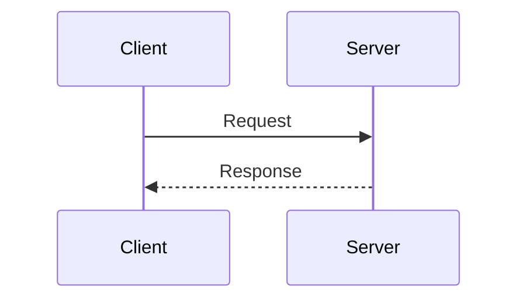
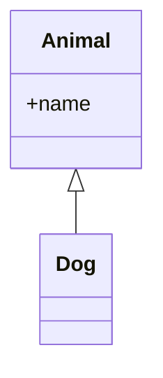
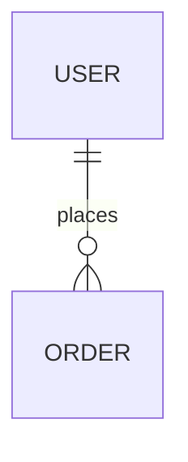
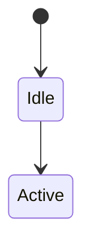
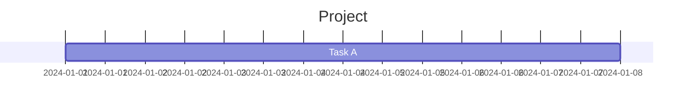

# Mermaid Generate Skill

코드나 문서를 분석하여 적절한 Mermaid 다이어그램을 자동 생성합니다.

## 사용법

이 스킬이 호출되면 다음을 수행하세요:

1. **인자 파싱**:
   - `--type <type>`: 다이어그램 타입 (flowchart, sequence, class, er, state, gantt)
   - `<path>`: 분석할 파일 또는 디렉토리 경로
   - `<description>`: 다이어그램 설명 (경로가 아닌 경우)

2. **코드/파일 분석**:
   - 경로가 주어지면 해당 파일/디렉토리를 분석
   - 설명이 주어지면 해당 프로세스를 다이어그램화

3. **다이어그램 생성**:
   - 분석 결과를 바탕으로 Mermaid 코드 생성
   - 적절한 타입이 지정되지 않으면 내용에 맞는 타입 자동 선택

## 다이어그램 타입별 생성 가이드

### Flowchart (flowchart)
- 프로세스 흐름, 의사결정 로직
- if/else, switch 문이 많은 코드


### Sequence (sequence)
- API 호출 흐름, 함수 호출 체인
- 서비스 간 통신


### Class (class)
- 클래스 구조, 상속 관계
- OOP 코드 분석


### ER Diagram (er)
- 데이터베이스 스키마
- 모델 관계


### State (state)
- 상태 머신, 라이프사이클
- 상태 전이가 있는 로직


### Gantt (gantt)
- 프로젝트 일정
- 태스크 의존성


## 실행 단계

1. 입력 분석 (파일/디렉토리/설명)
2. 코드 또는 컨텍스트 읽기
3. 적절한 다이어그램 타입 결정
4. Mermaid 코드 생성
5. 결과를 `.mmd` 파일로 저장 또는 에디터에 표시

## 예시

```
/mermaid-generate src/services/ --type sequence
# → 서비스 간 호출 흐름 시퀀스 다이어그램

/mermaid-generate src/models/ --type class
# → 모델 클래스 다이어그램

/mermaid-generate "사용자 로그인 프로세스" --type flowchart
# → 로그인 플로우차트

/mermaid-generate src/auth/
# → 코드 분석 후 적절한 타입 자동 선택
```

## 출력

생성된 다이어그램은:
1. 콘솔에 Mermaid 코드 출력
2. `generated-diagram.mmd` 파일로 저장
3. `/mermaid-render`로 바로 렌더링 가능

```bash
# 생성 후 바로 렌더링
/mermaid-generate src/ --type class && /mermaid-render generated-diagram.mmd
```