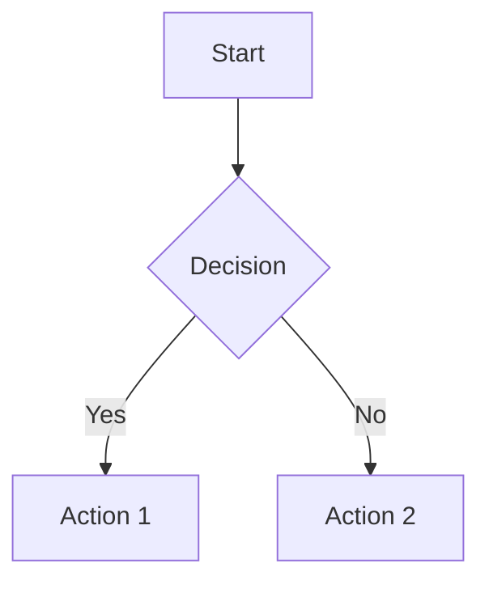
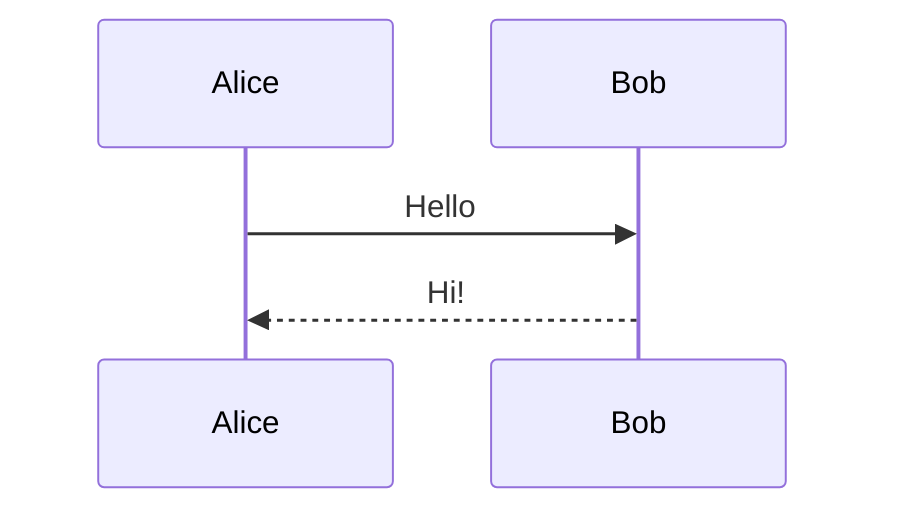
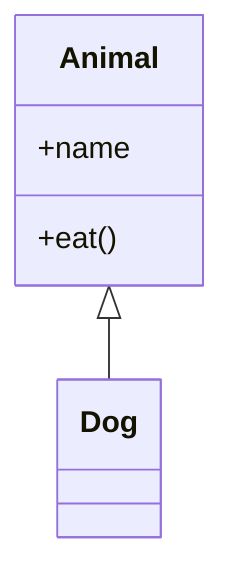

# Mermaid Live Editor

브라우저 기반 실시간 Mermaid.js 다이어그램 편집기

## 프로젝트 구조

```
mermaid-rendering/
├── index.html          # 메인 편집기 UI
├── styles.css          # 스타일시트
├── app.js              # 클라이언트 로직
├── server.js           # Express 로컬 서버
├── package.json        # 의존성
├── CLAUDE.md           # 이 파일
└── .claude/commands/   # Claude Code 스킬
    ├── mermaid-render.md
    └── mermaid-generate.md
```

## 개발 명령어

```bash
# 의존성 설치
npm install

# 서버 시작 (http://localhost:3000)
npm start

# 개발 모드 (자동 재시작)
npm run dev
```

## 편집기 기능

- **실시간 렌더링**: 코드 입력 시 즉시 다이어그램 업데이트
- **다이어그램 타입**: flowchart, sequence, class, state, ER, gantt, pie, mindmap, timeline, git
- **테마**: default, dark, forest, neutral
- **내보내기**: SVG, PNG
- **자동 저장**: localStorage에 코드 저장

## 키보드 단축키

- `Ctrl/Cmd + S`: 저장 (자동 저장됨)
- `Ctrl/Cmd + E`: SVG 내보내기
- `Esc`: 전체 화면 종료

## API 엔드포인트

- `GET /api/files` - .mmd 파일 목록
- `GET /api/load/:filename` - .mmd 파일 로드
- `POST /api/save/:filename` - .mmd 파일 저장
- `POST /api/render` - Mermaid 코드를 HTML로 렌더링

## Claude Code 스킬

### /mermaid-render
Mermaid 코드를 브라우저에서 렌더링합니다.

```bash
# 파일 렌더링
/mermaid-render diagram.mmd

# 코드 직접 렌더링
/mermaid-render "flowchart TD; A-->B"
```

### /mermaid-generate
코드나 문서를 분석하여 Mermaid 다이어그램을 자동 생성합니다.

```bash
# 코드 분석 후 클래스 다이어그램 생성
/mermaid-generate src/ --type class

# 프로세스 흐름 다이어그램 생성
/mermaid-generate --type flowchart "로그인 프로세스"
```

## Mermaid 문법 참고

공식 문서: https://mermaid.js.org/intro/

### Flowchart 예시


### Sequence 예시


### Class 예시


## 외부 연동

`window.MermaidEditor` API를 통해 외부에서 제어 가능:

```javascript
// 코드 설정
MermaidEditor.setCode('flowchart TD; A-->B');

// 코드 가져오기
const code = MermaidEditor.getCode();

// 다이어그램 렌더링
MermaidEditor.render();

// 내보내기
MermaidEditor.exportSVG();
MermaidEditor.exportPNG();
```
